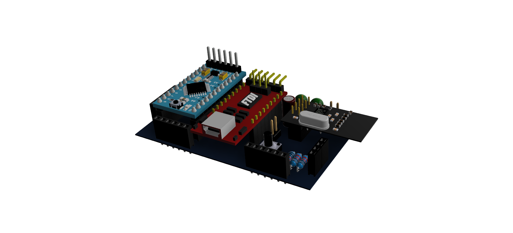

## KNoT Hardware PCBs

These are the open-source hardware PCBs of the KNoT Project.

### Overview

KNoT project includes three PCB types:

#### Starter Board

This board offers support for the embedded software development and preliminary hardware evaluation. They're build by the integration of existing modules and are composed of microcontroller, radio and power supply circuit. This boards help popularization of the KNoT Platform because they are cheaper and easier to distribute to the community.

#### Development Board

This PCB is self contained and has two goals: (i) to serve as a development platform with embedded firmware for prototypes that can be validated on field and (ii) to serve as baseline for specific hardware development for final products, as schematics and layouts can be rapidly customized to attend to specific demands.

#### Reference Design

The Reference Design is composed of hardware, firmware and (eventually) desktop/mobile software. They are designed to demonstrate the KNoT platform used in real solutions. A Reference Design can be based on a Starter or Development Board adapted to be used in a specific solution.

### Available Boards

#### KNoT Mini-Gateway Starter Board

KNoT Mini-Gateway Starter Board consists of a shield board for Raspberry Pi 2 and 3. This shield disposes of:

* 2x8 female header for easily coupling the Raspberry [Pi](https://www.raspberrypi.org/products/raspberry-pi-3-model-b/) 2/3 board.
* 2x4 female header for easily coupling a [nRF24L01+](https://www.nordicsemi.com/eng/Products/2.4GHz-RF/nRF24L01P) module for wireless communication with the KNoT Things
* 2x Push Buttons, Pair and Reset function(with external pull-up resistor circuit and a capacitive high frequency filter)
* 3x LEDs. 1x red status LED and 2x green LED.

All modules are mapped into the Raspberry Pi pins so no extra jumpers are required to use it, just need to connect the modules. (you can see pins connections in the mini-gateway starter board schematic file).

#### KNoT Thing Starter Board

KNoT Thing Starter Board is a device board based on Arduino and nRF24L01+ radio. This PCB integrates an [Arduino Pro Mini 5V 16MHz](https://www.arduino.cc/en/Main/arduinoBoardProMini), a nRF24L01+ 2.4GHz module and a FTDI module. This kit serves as a support PCB for software development and preliminary hardware evaluation.

* Compatible with Arduino IDE
* Supplied via Mini-USB conector
* Clear EEPROM Push Button
* GPIOs Access Headers

#### KNoT Thing Development Board

KNoT Thing Development Board consists of an Arduino based PCB with the ATMega328 microcontroler, nRF24L01+ circuit, headers for SPI and I²C communication, push button and status led.

* Suports KNoT version 01.00
* Compatible with Arduino IDE
* Supplied via Micro-USB conector
* nRF24L01+ radio with external antenna
* ATMega328-AU Micro-controller
* Programmed through FTDI232RL USB-Serial converter

KNoT Thing DevBoard PCBs are compatible with the Arduino IDE and may be integrated with peripherals through expansion connectors.
Before using the PCB, it's important to burn the bootloader to the Atmega328 micro-controller. For this PCB, the Arduino Pro Mini 3.3V 8MHz bootloader is used ([ATmegaBOOT_168_atmega328_pro_8MHz.hex](https://github.com/arduino/Arduino/blob/master/hardware/arduino/avr/bootloaders/atmega/ATmegaBOOT_168_atmega328_pro_8MHz.hex)). The use of ICSP is recommended for burning the bootloader via the 3x2 header with SPI interface using an Atmel SPI Programmer and Atmel Studio. Besides burning the bootloader, the ATMega328 fuses also need to be programmed via ICSP with the values:
- Extended: 0xFD
- High: 0xDA
- Low: 0xFF

### Development tools

The ECAD tool used is Altium Designer versions 14.2.3 and 14.2.4.

### PCB Files

Each PCB project includes:
 - Components Library
 - Schematics
 - Board Layout

The generated output files are:
 - Bill Of Materials
 - Gerber
 - NC Drill
 - PCADNetlist
 - Assembly Drawing
 - Composite Drawing
 - Pick and Place
 - Schematics (PDF)
